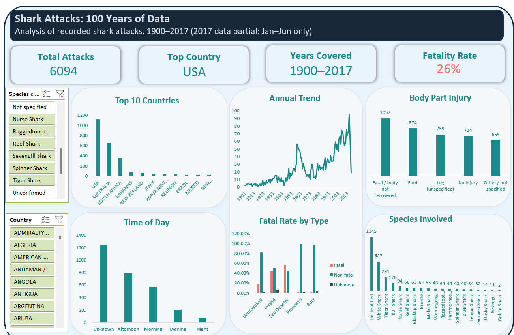

# Shark Attacks: 100 Years of Data — Digitaley Drive Data Analyst Bootcamp Capstone

An Excel analysis of a century of recorded shark attacks, built to uncover patterns in when, where, and how these incidents occur.

**Tool:** Microsoft Excel (Power Query, PivotTables, PivotCharts)
**Dataset:** Global Shark Attack survey, 1900–2017 — 6,094 cleaned records (from 25,614 raw rows)

---

## Executive Summary

This project analyzes 6,094 recorded shark attacks spanning over a century (1900–2017) to answer six guiding questions: how attack frequency has changed over time, which countries and locations carry the most risk, what body parts are most commonly injured, whether time of day plays a role, which species are most often involved, and what patterns emerge once the data is properly cleaned.

The raw dataset was far messier than it first appeared. Of 25,614 rows in the source file, only 6,094 were real records; the rest were blank padding. Getting to a trustworthy analysis required extensive cleaning: standardizing inconsistent Type and Fatal (Y/N) values, fixing data-entry typos, and parsing free-text fields (Age, Time, Species, Injury) into structured categories using text extraction. Two genuine data-quality issues were also uncovered and corrected for during analysis: a date-conversion bug that silently shifted some pre-2000 dates into the 2000s, and an incomplete final year (2017 data runs only through June), both of which are documented so they don't lead to a misread trend.

**Headline findings:**
- Recorded attacks have risen sharply since the 1950s, climbing from under 20 a year in the early 1900s to well over 100 a year by the 2010s — a trend far more consistent with increased beach tourism and far better incident reporting than with sharks becoming more dangerous.
- The United States records by far the most attacks (2,160), driven heavily by Florida, followed by Australia (1,303) and South Africa (571).
- Only 25.7% of attacks are fatal overall, but that figure hides a striking pattern: "Sea Disaster" and "Invalid" incidents are fatal far more often (69% and 46% respectively) than genuine unprovoked shark encounters (26%), meaning the most dangerous recorded incidents often aren't really shark attacks at all.
- The foot is the single most commonly injured body part (874 cases), and over half of all records have no recorded time of day at all, a real gap in the historical data, not an analysis failure.
- Among attacks where a species could be identified, the white shark accounts for the most incidents (627), though the single largest category remains attacks where no species was ever recorded or confirmed (1,145+).

The full write-up, including methodology and detailed findings, is in [`Shark_Attacks_Capstone_Report.docx`](./Shark_Attacks_Capstone_Report.docx).

---

## Project Overview

This capstone was assigned as part of the Digitaley Drive Data Analyst Bootcamp. The brief frames the analyst as contracted to analyze a shark attack dataset and uncover meaningful patterns from it, applying Power Query, data modeling, data cleaning, data visualization, and insight generation. Six guiding questions were set:

1. What trends appear in the number of shark attacks annually since 1900?
2. Which countries report the most attacks, and which specific areas and locations within them are most dangerous?
3. (The brief flags that the data requires substantial cleaning before it can be analyzed — addressed throughout this report.)
4. What body parts are most often injured?
5. Are shark attacks more common at certain times of day?
6. Which species of shark are attacking most often?

The deliverable is an interactive Excel dashboard built around these six questions, supported by the full written analysis.

---

## Data Sources

The dataset is a historical record of shark attacks compiled from incident reports, provided as a single spreadsheet of 25,614 rows and 22 columns. Only 6,094 of those rows contained real records — the remainder were blank padding rows and one stray marker row at the very end of the file, both removed during cleaning.

| Field | Description |
|---|---|
| Case Number | Unique identifier for each incident |
| Date / Year | When the attack occurred |
| Type | Unprovoked, Provoked, Invalid, Boat, or Sea Disaster |
| Country / Area / Location | Where the attack occurred |
| Activity | What the victim was doing (surfing, swimming, fishing, etc.) |
| Name / Sex / Age | Victim details |
| Injury | Free-text description of the injury sustained |
| Fatal (Y/N) | Whether the incident was fatal |
| Time | Time of day, where recorded |
| Species | Shark species involved, where identified |

Three near-duplicate Case Number columns existed in the source file; the primary Case Number column was kept as the source of truth after confirming 16 rows had minor mismatches between the duplicates — a known inconsistency in the original source data.

---

## Data Cleaning & Transformation

Cleaning was done in Power Query and Excel formulas:

- **Blank rows removed.** Of 25,614 rows, only 6,094 contained real data — filtering to rows where both Case Number and Date had a value isolated the genuine records.
- **Unneeded columns dropped.** Source-file link columns and duplicate Case Number columns were removed.
- **Type standardized** — "Boat" and "Boating" merged into one category.
- **Fatal (Y/N) standardized** — casing fixed, and two genuine data-entry errors corrected: a stray "2017" value (confirmed non-fatal by the injury text) and an "F" that should have read "Y" (confirmed fatal by "human remains washed ashore").
- **Sex cleaned** — a handful of stray values corrected or relabeled "Unknown" based on context.
- **Age extracted from free text** — only 3,376 of 6,094 rows had any age data; parsing recovered a usable number for 3,350 rows (direct figures kept, "Teen" → 15, "20s" → 25, multi-victim entries took the first value).
- **Time bucketed** — only 2,844 of 6,094 rows had a time at all; parsed into Morning/Afternoon/Evening/Night. More than half of all records (3,351) have no time information whatsoever — a real limitation of the historical data.
- **Species simplified** — free text matched against 20+ known species names; doubtful cases flagged "Unconfirmed."
- **Injury parsed into Body Part** — 18 categories extracted via keyword matching, ordered so specific terms (e.g., "toe") are checked before broader ones (e.g., "leg").

**Two data-quality issues identified during analysis:**
- **A date-conversion limitation:** Excel's automatic date parsing interpreted some pre-2000 two-digit-year dates as the 2000s (e.g., a 1917 incident appearing as 2017). Caught by cross-checking against the dataset's independent Year field, which was unaffected — all analysis here, including the annual trend, relies on Year, not the parsed date field.
- **2017 is incomplete**, covering only January through June. The apparent decline at the end of the annual trend chart reflects this partial-year cutoff, not a real drop in attacks.

**16 duplicate Case Numbers** were identified — in most cases, two different victims from the same incident were assigned the same case ID by the original compilers. All rows were retained rather than arbitrarily dropping one of each pair.

---

## Analysis

### Q1 — Annual trend since 1900

Recorded attacks have risen sharply, from fewer than 20 a year in the early 1900s to a peak of over 140 in a single year by the 2010s, with a smaller spike around the 1950s–60s. This rise reflects growth in beach tourism and improved incident reporting, not sharks becoming more dangerous. The apparent dip at the very end reflects 2017's incomplete data (Jan–Jun only), not a real decline.

### Q2 — Countries and dangerous locations

The US records by far the most attacks (2,160), followed by Australia (1,303) and South Africa (571). Within these countries, risk concentrates heavily: Florida leads in the US, New South Wales in Australia, KwaZulu-Natal in South Africa.

### Q4 — Body parts injured

The foot is the most common injury site (874 cases), followed by non-specific leg injuries (759) and hand injuries (399). 1,057 records are classified as "Fatal / body not recovered" — the single largest category overall. A further 734 records explicitly note "No injury."

### Q5 — Time of day

Afternoon is the most common period for attacks among records with a known time, followed by morning. However, more than half of all records (3,351) have no time of day recorded at all — the "Unknown" category is the single largest bar in this chart.

### Q6 — Species involved

Among identified attacks, the white shark is involved most often (627), followed by tiger shark (291) and bull shark (170). The largest single category, however, is "Unidentified shark" (1,145) — species-level conclusions are directionally useful but built on a relatively small, non-random subset of well-documented cases.

### Additional insight — Fatal rate by incident type

Overall fatality is 25.7%, but "Sea Disaster" incidents are fatal 69% of the time and "Invalid" incidents 46% of the time — both far higher than genuine "Unprovoked" shark encounters (26%). The recorded incidents most likely to end in death are frequently not actual shark attacks at all, but maritime accidents or ambiguous cases swept into the same dataset.

---

## Key Findings

1. **The rising trend is a reporting and exposure story**, not a shark behavior story — driven by tourism growth and better documentation, not sharks becoming more aggressive.
2. **Risk is geographically concentrated** in specific regions (Florida, New South Wales, KwaZulu-Natal) rather than spread evenly.
3. **The most fatal incidents often aren't genuine shark attacks** — Sea Disaster and Invalid cases are far more often fatal than real unprovoked encounters.
4. **The foot is the most common injury site**, while a meaningful share of records involved no injury at all or were too severe to document specifically.
5. **Time-of-day and species findings are informative but incomplete** — over half of all records lack a time, and the largest species category is "Unidentified." These are honest limits of a century-spanning historical dataset, not analysis failures.
6. **Two data-quality issues were identified and corrected for**: a date-parsing bug affecting pre-2000 dates, and an incomplete final year (2017, Jan–Jun only).

---

## Recommendations

- **For beachgoers:** the data supports practical, evidence-backed caution around afternoon water use in well-known high-incidence regions, rather than generalized fear.
- **For coastal safety organizations and researchers:** the gaps in time-of-day and species data represent a clear opportunity — more consistent future reporting would substantially strengthen analyses like this one.
- **For anyone citing "shark attack" statistics:** real caution is warranted before treating "Type" categories uniformly — Sea Disaster and Invalid incidents behave very differently from genuine unprovoked encounters, and conflating them risks overstating the danger of an actual shark encounter specifically.
- **For future iterations:** re-running this analysis with the corrected date field and an updated dataset (2018 onward) would resolve both data-quality caveats and allow the annual trend to be read without qualification.

---

## Repository Contents

- `Shark_Attacks_Capstone_Report.docx` — full written report (this README condensed from it)
- `Shark_Attacks_CLEANED.xlsx` — cleaned dataset and interactive dashboard
- `screenshots/` — dashboard screenshots

---

*Prepared by Abiola Damilola Mercy for the Digitaley Drive Data Analyst Bootcamp capstone.*
